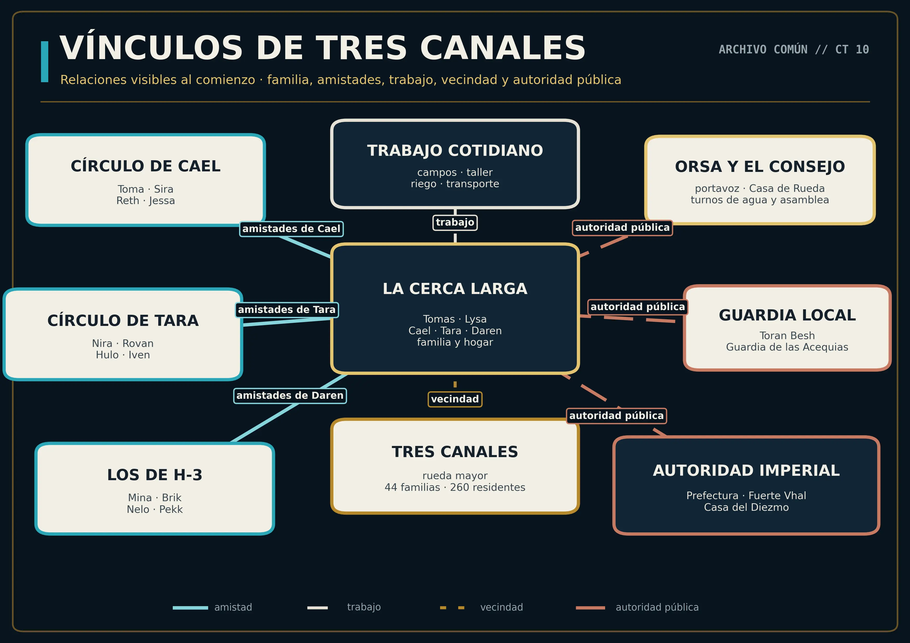

---
hide:
  - toc
---

PROTAGONISTAS · ACCESO DE JUGADOR

# Los hermanos de La Cerca Larga

Cael, Tara y Daren han crecido en Tres Canales. Comparten hogar, historia y una comunidad; cada uno mantiene también relaciones, recuerdos y preguntas propias.

◈

<strong>Expedientes públicos</strong>

Estas descripciones contienen solo lo que la familia y la comunidad conocen. Los anexos personales permanecen en sobres separados.

<figure class="sw-wide-figure">
  
  <figcaption>Vínculos visibles al inicio: familia, amistad, trabajo, vecindad y autoridad pública. Pulsa para ampliar.</figcaption>
</figure>

## Cael Raal

**Edad:** 23 años  
**Papel conocido:** agricultor y reparador  
**Hogar:** [La Cerca Larga](../varduun/la-cerca-larga.md)  
**Círculo visible:** Toma Pellan, Sira Daal, Reth Marr y Jessa Dorr

Hijo mayor de Lysa Vey y del difunto Corven Raal. Tomas le enseñó agricultura, reparación de maquinaria y manejo del rifle. Es competente, paciente y poco dado a precipitarse cuando una máquina, una cosecha o una persona pueden pagar el precio.

Trabaja en los campos, en La Cerca Larga y, cuando hacen falta fuerza y constancia, en **El Eje Partido** o las instalaciones de riego. Su círculo lo conecta con transporte, Guardia, talleres y canales.

## Tara Raal

**Edad:** 18 años  
**Papel conocido:** exploradora de la comarca  
**Hogar:** [La Cerca Larga](../varduun/la-cerca-larga.md)  
**Círculo visible:** Nira Bol, Rovan Tesk, Hulo Oruun e Iven Saar

Hija de Lysa y Corven, y hermana de Cael y Daren. Es curiosa, inteligente y conoce canales, lindes, caminos secundarios y estaciones meteorológicas que muchos adultos apenas visitan.

Nira es su mejor amiga; Hulo comparte sus salidas de observación; Iven alimenta sin esfuerzo los rumores románticos del asentamiento, y Rovan Tesk lo trata como rival mientras corteja a Tara de forma poco discreta.

## Daren Orlan

**Edad:** 13 años  
**Papel conocido:** hijo menor y miembro de «los de H-3»  
**Hogar:** [La Cerca Larga](../varduun/la-cerca-larga.md)  
**Círculo visible:** Mina Tal, Brik Besh, Nelo Parn y Pekk Varo

Hijo de Tomas y Lysa. Ayuda en la explotación, protesta por casi cada tarea y da por sentado que algún día heredará la granja. Su pandilla recorre los alrededores de la Estación de Aforo H-3 con más curiosidad que prudencia.

Mina aporta vendas y sensatez; Brik convierte cualquier salida en una patrulla; Nelo construye artefactos con chatarra y no respeta demasiado las puertas cerradas; Pekk detecta huellas y problemas antes que los demás.

## Familia y vínculos

Los tres se consideran hermanos sin necesidad de matices. Tomas es padre de Daren y padre de crianza de Cael y Tara; Lysa mantiene unido el hogar y administra reservas e intercambios. La historia familiar compartida está en el expediente de [La Cerca Larga](../varduun/la-cerca-larga.md).

Consulta el [índice de PNJ conocidos](../pnj/index.md) para abrir los expedientes individuales disponibles.

!!! warning "Sobres privados"
    Los recuerdos personales y las confidencias de cada protagonista no se publican aquí. Cada jugador debe conservar únicamente su propio anexo.

