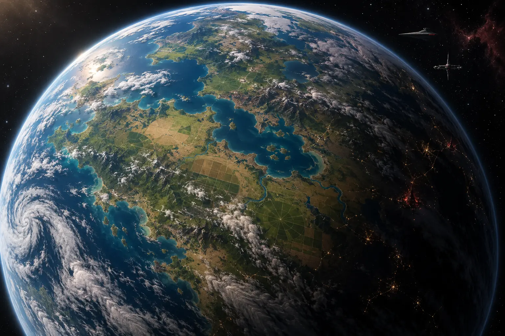

# Varduun

<figure class="sw-world-hero">
  
  <figcaption>Varduun: un mundo agrícola cuya vida depende del agua, las cosechas y las rutas exteriores.</figcaption>
</figure>

**Sistema:** Keluun, tercer planeta  
**Región:** Borde Exterior, cuadrícula R-8  
**Situación política:** protectorado del Imperio Sith desde CT 0  
**Capital:** Karrad Landing  
**Población estimada:** 320.000 habitantes  
**Ciclo local:** días de 30 horas; año local largo  
**Lunas:** Asha y Keth  
**Estado del archivo:** conocimiento compartido al inicio de CT 10

Varduun es el único mundo naturalmente habitable del [sistema de Keluun](sistema-keluun.md). Sus llanuras basálticas, acuíferos profundos y largas horas de luz lo convierten en un productor extraordinario siempre que el agua llegue a tiempo.

La población vive sobre todo en granjas, asentamientos fluviales y **ruedas de labor**. Humanos, twi'leks, ithorianos, duros y otras especies sostienen una economía de cereal talis, legumbre marru, forraje, nerfs, semillas resistentes, productos procesados, hongos medicinales y biomasa.

La tecnología espacial convive con bombas, droides y cosechadoras reparados durante décadas. Varduun exporta alimento, pero depende del exterior para maquinaria, combustible, fertilizantes, semillas industriales, medicinas, piezas y armas.

## Tierra, agua y autoridad

La tierra pertenece a familias concretas. Los grandes pozos, presas y canales se consideran bienes colectivos. Esa diferencia sostiene el **Pacto de las Cuencas** y una máxima más antigua que el Protectorado:

> **El agua no pertenece al primero que llega, sino a todos los que la necesitan.**

El Imperio expulsó a los piratas cuando la República dejó de acudir. A cambio obtuvo una guarnición, control orbital, derecho de veto y una cuota anual de alimentos. Las familias siguen figurando como propietarias; la Prefectura controla cada vez más aquello sin lo cual no pueden trabajar: crédito, semillas, repuestos, licencias, puerto y mercado.

## La situación en CT 10

La [Cosecha Gris](cosecha-gris.md) apareció a finales de CT 9. Las raíces pierden color y se deshacen, los cultivos colapsan y algunas personas y animales presentan síntomas. El Instituto Agrícola investiga. La causa es desconocida y la cuota imperial no se ha reducido.

Varduun no está en guerra. La mayoría de sus habitantes ve a más guardias locales que soldados. La presión llega mediante inspecciones, cuentas bloqueadas, silos precintados, licencias retiradas y manifiestos rechazados. La protección imperial y el control económico son dos verdades que conviven.

## Explorar el archivo

-   **Sistema de Keluun**

    Mapa galáctico, mundos, lunas, rutas e instalaciones orbitales.

    [:octicons-arrow-right-24: Abrir](sistema-keluun.md)

-   **Campos de Harn**

    Ruedas de labor, costumbres, comunidades y tensiones de la región.

    [:octicons-arrow-right-24: Abrir](campos-harn.md)

-   **Tres Canales**

    Mapa civil, canales, zonas, gobierno y nueve enclaves cotidianos.

    [:octicons-arrow-right-24: Abrir](tres-canales.md)

-   **La Cerca Larga**

    El hogar Orlan-Vey y la historia familiar que todos comparten.

    [:octicons-arrow-right-24: Abrir](la-cerca-larga.md)

-   **La Cosecha Gris**

    Síntomas, certezas, sospechas, rumores y preguntas abiertas.

    [:octicons-arrow-right-24: Abrir](cosecha-gris.md)

-   **Historia local**

    De la primera colonia a la Carta de Protección y CT 10.

    [:octicons-arrow-right-24: Abrir](cronologia.md)

-   **Autoridades y facciones**

    Consejo de las Cuencas, Guardia, Prefectura y poderes económicos.

    [:octicons-arrow-right-24: Abrir](facciones-locales.md)

-   **Rumores conocidos**

    Versiones que circulan sin convertirse todavía en hechos.

    [:octicons-arrow-right-24: Abrir](rumores.md)

!!! note "Principio del archivo"
    Estas páginas solo documentan conocimiento de jugador. Lo no descubierto y la información exclusiva de cada personaje permanecen fuera del Holocron público.

