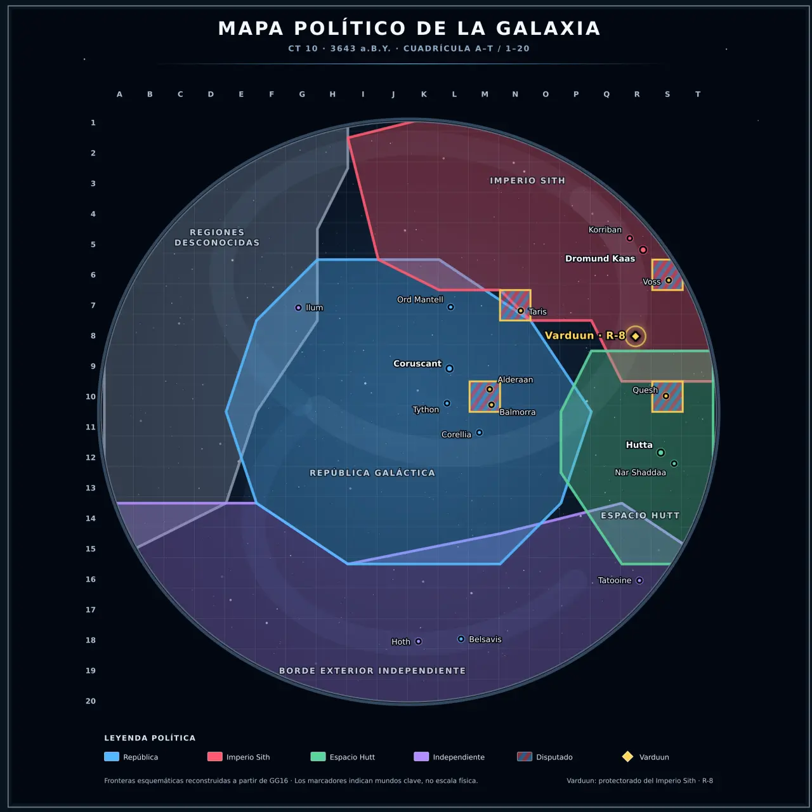

# El sistema de Keluun

<figure class="sw-wide-figure">
  
  <figcaption>Varduun se encuentra en el Borde Exterior, cuadrícula R-8. Pulsa el mapa para ampliarlo.</figcaption>
</figure>

**Estrella:** Keluun, amarilla y estable  
**Mundo habitado:** Varduun, tercer planeta  
**Región:** Borde Exterior, cuadrícula R-8  
**Acceso legal:** Ramal Karrad  
**Autoridad orbital:** estación Cosecha Negra  
**Estado del archivo:** conocimiento compartido al inicio de CT 10

Varduun ocupa el extremo de un ramal secundario. Queda al suroeste de **Kaon** y **Voss**, y al noroeste de **Quesh** y del **Espacio Hutt**. No pertenece al Sector Esstran ni a los Mundos Sith.

La ruta principal enlaza con el espacio imperial; otros trayectos conducen hacia Quesh, el norte del Espacio Hutt y antiguos territorios republicanos como Taris y Balmorra. Para la mayoría de habitantes esos nombres son noticias y cargamentos, no destinos visitados.

## Cuerpos del sistema

| Orden | Cuerpo | Conocimiento común |
|---:|---|---|
| 1 | **Rhess** | Pequeño mundo rocoso abrasado por Keluun. Colectores solares automáticos alimentan parte de la red interior. |
| 2 | **Velka** | Planeta de nubes amarillentas, gases corrosivos y tormentas; plataformas automáticas extraen materiales de sus capas altas. |
| 3 | **Varduun** | Único mundo naturalmente habitable y centro político, económico y demográfico del sistema. |
| — | **Arco Karrad** | Cinturón de asteroides entre Varduun y Caldra. Refugio pirata durante los Años del Cielo Vacío; aún se habla de restos, minas y balizas apagadas. |
| 4 | **Caldra** | Desierto frío de atmósfera tenue. Conserva un proyecto agrícola republicano abandonado durante la guerra. |
| 5 | **Molkar** | Gigante gaseoso ocre, verde y marrón. La plataforma **Molkar-3** extrae combustible, refrigerantes y gases industriales. |
| 6 | **Nydros** | Gigante helado azul oscuro junto a la entrada habitual desde el ramal hiperespacial septentrional. |

## Las lunas de Varduun

### Asha

La luna mayor y más clara. Sus fases influyen en las aguas subterráneas y en las crecidas estacionales. **Asha-1**, antigua estación meteorológica republicana, forma ahora parte de la red imperial y observa tormentas, humedad, incendios y extensión de cultivos.

### Keth

Pequeña, oscura e irregular. Contiene hielo y minerales. En su cara septentrional se encuentra **Keth-7**, llamada *La Cantera*: una colonia penal imperial sobre una explotación minera republicana. Allí se envía a personas condenadas por piratería, contrabando, sabotaje y robo de cargamentos.

## Rutas e instalaciones

| Nombre | Función conocida |
|---|---|
| **Ramal Karrad** | Entrada legal desde Kaon, Voss y el espacio imperial. |
| **Faro Karrad** | Baliza republicana atendida sobre todo por droides; guía a los cargueros y transmite sus identificadores. |
| **Paso de Molkar** | Ruta antigua hacia Quesh y el norte del Espacio Hutt. Sin balizas fiables y con perturbaciones gravitatorias. |
| **Cosecha Negra** | Controla tráfico, aduanas, comunicaciones, inspecciones, manifiestos y la salida del tributo. |
| **Molkar-3** | Plataforma de extracción y repostaje usada por patrullas y cargueros autorizados. |
| **Asha-1** | Estación meteorológica y agrícola integrada en la red imperial. |

!!! info "Salir de Varduun"
    Hacen falta una nave, un manifiesto autorizado y permiso orbital. Una avería en el Faro Karrad o un cierre de tráfico puede aislar el planeta durante días.
