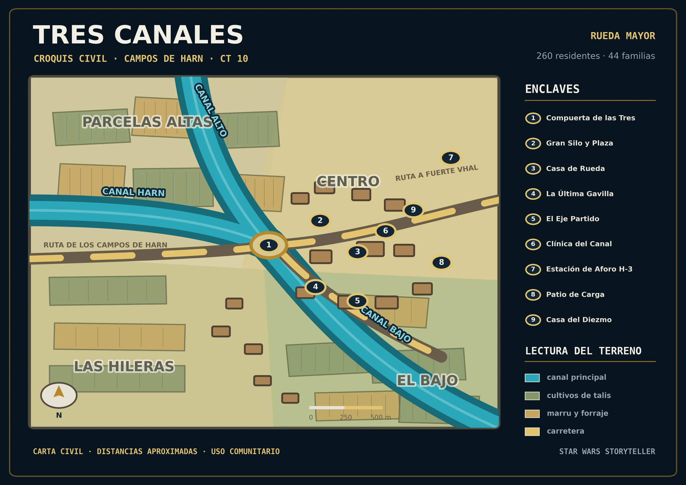

# Tres Canales

<figure class="sw-wide-figure">
  
  <figcaption>Croquis civil de Tres Canales. Pulsa el mapa para ampliarlo.</figcaption>
</figure>

**Tipo:** rueda mayor de los Campos de Harn  
**Población permanente:** 260 personas, 44 familias  
**Población en mercado:** más de 500 personas  
**Población durante cosecha:** hasta unas 700  
**Portavoz:** Orsa Pellan  
**Actividad:** agricultura, almacenamiento, reparación, mercado y transporte

Tres Canales no es una ciudad. Creció alrededor del punto donde confluyen tres conducciones principales. Desde lejos parece un gran silo rodeado de casas bajas; de cerca aparecen toldos, talleres, hangares, corrales y tuberías sobre y bajo el suelo. El aire suele oler a cereal seco, aceite de maquinaria y agua recalentada.

## Los tres canales

| Canal | Función | Quién depende de él |
|---|---|---|
| **Canal Harn** | El más antiguo y fiable; trae agua de los acuíferos septentrionales. | Cultivos de talis y buena parte de la producción para exportación. |
| **Canal Alto** | Desciende de un embalse oriental y mueve turbinas. Es el mejor mantenido. | Huertas, marru, depósitos de consumo y las parcelas más acomodadas. |
| **Canal Bajo** | Recibe caudal tras la confluencia y aguas de retorno filtradas. | Pastos, corrales, jornaleros y pequeños propietarios. Aquí apareció primero la Gris. |

Los canales Harn y Alto confluyen en la **Compuerta de las Tres**. Desde allí se redistribuye el agua. Solo tres técnicos dominan por completo una instalación llena de piezas que ya no se fabrican; Orsa Pellan es la más experimentada y Jessa Dorr mantiene con frecuencia sensores y bombas.

## Las cuatro zonas

| Zona | Situación y ambiente |
|---|---|
| **El Centro** | Plaza del Silo, Casa de Rueda, cantina y servicios. Comerciantes, mecánicos y familias sin tierra propia. |
| **Parcelas Altas** | Junto al Canal Alto. Casas modernas, mejores máquinas y contratos con los Tesk. |
| **Las Hileras** | Sector más antiguo, a lo largo del Canal Harn. Aquí está [La Cerca Larga](la-cerca-larga.md). |
| **El Bajo** | Canal Bajo, corrales y filtrado. Zona más pobre y primer foco visible de la Cosecha Gris. |

## Gobierno y reparto

Orsa Pellan es portavoz, acompañada por un consejo local de siete miembros: dos propietarios agrícolas, una persona ganadera, una responsable del agua, un representante de talleres y transportes, uno de jornaleros y la responsable sanitaria.

Las decisiones ordinarias se toman por mayoría. Desviar agua, expulsar a una familia o abrir las reservas requiere asamblea general. Cada familia propietaria puede votar; los jornaleros sin tierra pueden hablar, pero no votar.

### El orden de una cosecha

| Procedimiento oficial | Costumbre de Harn |
|---|---|
| 1. El grano entra en el Gran Silo. | 1. Se reserva alimento. |
| 2. H-3 mide cantidad y calidad. | 2. Se guarda semilla para la siguiente estación. |
| 3. La Casa del Diezmo retira la cuota. | 3. Se entrega el excedente. |
| 4. Se separan semillas. | — |
| 5. El resto queda para consumo, mercado y deuda. | — |

Mientras las cosechas abundaban, la diferencia podía ocultarse. Con la Gris, el orden decide quién come y si habrá algo que sembrar.

## Nueve enclaves conocidos

1. **Compuerta de las Tres.** Corazón hidráulico de la rueda y lugar de las disputas por el caudal.
2. **Gran Silo y Plaza.** Almacén, mercado, celebraciones y plataforma de pesaje del Diezmo.
3. **Casa de Rueda.** Ayuntamiento, escuela, tribunal, asamblea y refugio.
4. **La Última Gavilla.** Cantina de Vela Nareen y principal cruce de noticias y contratos.
5. **El Eje Partido.** Taller de Kered y Nira Bol; rescata máquinas que ya deberían haberse rendido.
6. **Clínica del Canal.** Seis camas, poca bacta, Hessa Tal y el droide médico MD-4H, «Medi».
7. **Estación de Aforo H-3.** Básculas, análisis de grano, sensores de agua y registros conectados al Diezmo.
8. **Patio de Carga.** Grúas, combustible, mantenimiento y cargamentos hacia Karrad Landing.
9. **Casa del Diezmo.** Cuotas, deudas, licencias, semillas, permisos y maquinaria embargada.

## Costumbres y seguridad

Cada seis días la Plaza del Silo acoge el mercado. La **Mesa Larga** reúne a todos durante la cosecha: cada hogar aporta comida y nadie pregunta cuánto. En la **Apertura de Aguas**, la persona más joven de cada familia deposita semillas en la Compuerta antes de abrir los canales. Las **Marcas del Canal** recuerdan a quienes murieron trabajando o defendiendo la rueda.

La seguridad diaria corresponde a nueve miembros locales de la **Guardia de las Acequias**, dirigidos por Toran Besh. La presencia imperial aparece sobre todo como inspectores, droides de medición, patrullas ocasionales y restricciones administrativas.

## Situación al inicio

Tres Canales aún no está en rebelión ni bajo cuarentena. El mercado abre, la Guardia patrulla y las bombas funcionan. Pero la [Cosecha Gris](cosecha-gris.md), la cuota, las deudas y el debate sobre cerrar el Canal Bajo han convertido cada decisión técnica en una elección política.

